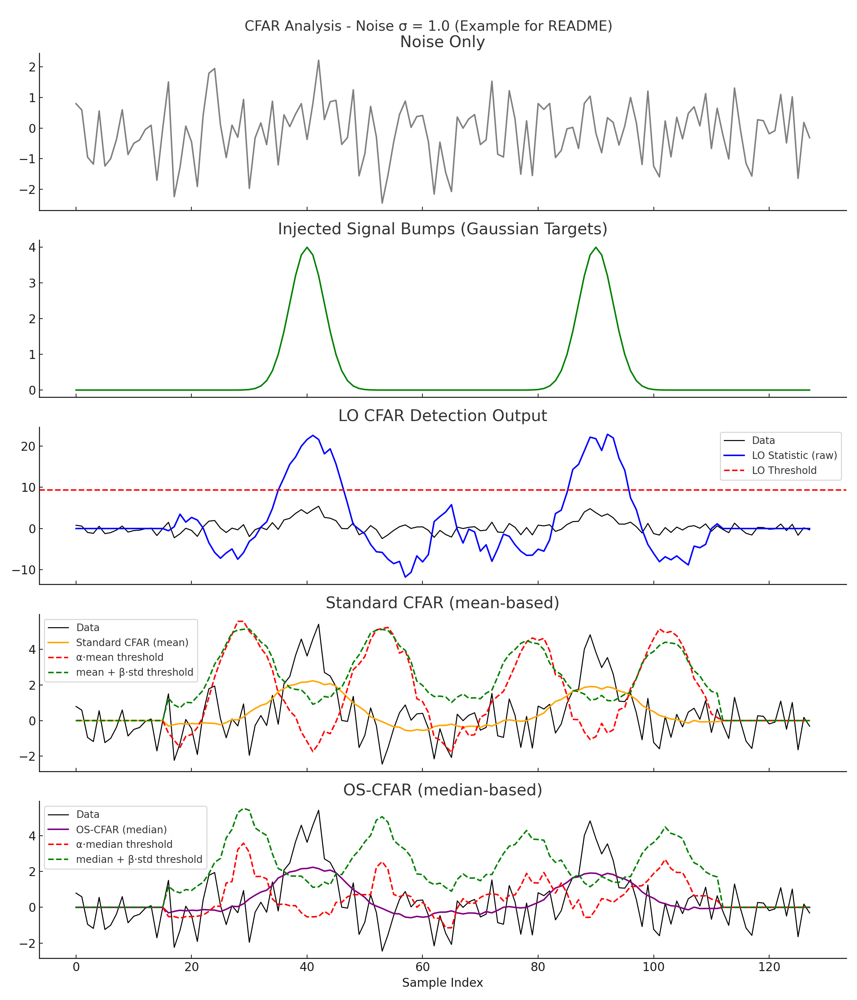

# CFAR Detection Comparison

This project demonstrates and compares three Constant False Alarm Rate (CFAR) radar detection algorithms using synthetic 1D range data:

- **LO-CFAR** (Locally Optimal Rank Detector)
- **Standard CFAR** (mean-based)
- **OS-CFAR** (median-based)

## Features

- Simulates radar signal embedded in Gaussian noise
- Sliding window detection across 128-sample signal
- Adjustable noise standard deviation (σ)
- Displays and compares:
  - Raw signal and injected targets
  - Detection statistics for each method
  - Thresholds for detection

## Example Output

Below is an example output showing the detection curves for noise standard deviation σ = 1.0:

## Requirements

- Python 3.x
- numpy
- matplotlib
- scipy

## Usage

Simply run the script to generate and display detection results for 3 different noise levels (low, medium, high). Each detection method is shown with appropriate thresholds and visual comparison.

